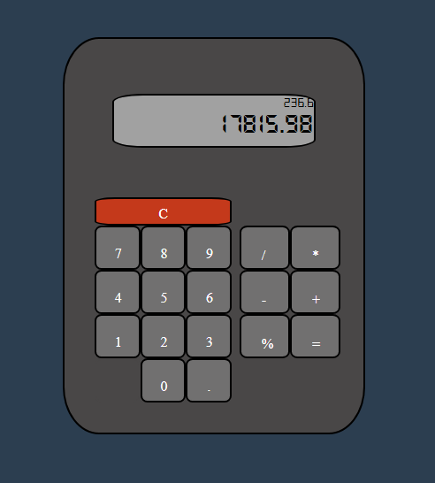

# Calculator
### It is a calculator
#### I think there is no doubt
---

Created with VanillaJS, HTML & CSS. It is for The Odin Project Assignment. 

It does not handle 0.1 + 0.2 case, because why it should?

For more info, you can check [IEEE 754](https://ieeexplore.ieee.org/document/8766229)

It may contain some bugs but I do not have time for insect powder.

It is responsive (by nature of flexboxes) but not mobile-friendly. So use desktop layout for best result. 

